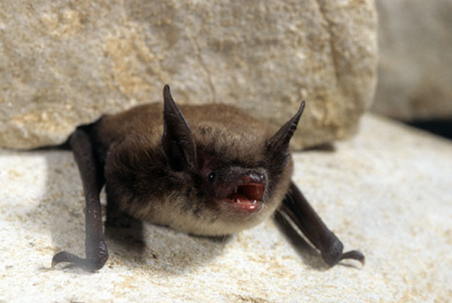
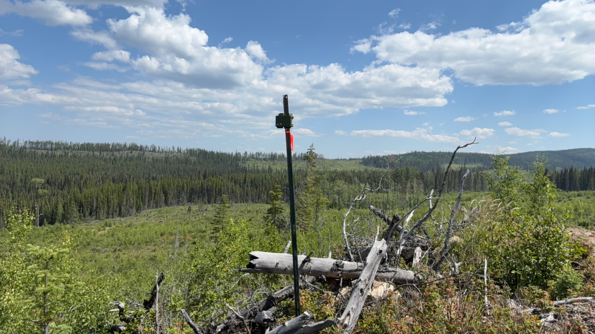



{style="float:left`;" fig-alt="MYLU - John MacGregor" fig-align="left"}

```{r}
#| label: setup - load libraries and data
#| include: false
#| echo: false
#| eval: true
#| warning: false
#| message: false

library(ggplot2)
library(dplyr)
library(tinytex)
library(quarto)
library(lubridate)
library(flextable)
library(tidyverse)
library(kableExtra)
library(readr)
library(leaflet)
library(sf)

df <- read.csv("Data/GUANO_Complete_Metadata_20260130_112825.csv")
sites <- read_csv("Data/Pemberton_Survey123.csv")%>%
  rename_with(~ gsub(" ", ".", .x))

#make sure that the columns are the proper classes
sites$Date.Recording.Started <- as.Date(mdy_hms(sites$Date.Recording.Started))
sites$Date.Recording.Ended <- as.Date(mdy_hms(sites$Date.Recording.Ended))

sites <- sites %>%
    mutate(
    nights = as.numeric(difftime(Date.Recording.Ended, Date.Recording.Started, units = "days")) + 1)

```

```{r}
#| label: setup - create sites table and sites_sf
#| include: false
#| echo: false
#| eval: true
#| warning: false
#| message: false
# Create cleaned dataframe with selected columns
sites_table <- sites[, c("Grid.Cell.Identifier",
                         "Grid.Cell.(GRTS).ID",
                          "x", 
                          "y", 
                          "Date.Recording.Started", 
                          "Date.Recording.Ended",
                          "Bat.Detector.Model",
                          "Detector.ID/Serial.Number")]
#keep a copy without the renamed columns to use for creating the map
sites_sf <- sites_table|>
  filter(!is.na(y) & !is.na(x)) |>
  sf::st_as_sf(coords = c("x", "y"), crs = 4326)

# Rename columns for better readability in the report
colnames(sites_table) <- c("Location Name",
                           "NABat GRTS ID",
                            "Longitude",
                            "Latitude",
                            "Start Date",
                            "End Date",
                            "Detector Model",
                            "Detector Serial Number")
sites_table$`NABat GRTS ID` <- as.character(sites_table$`NABat GRTS ID`)


```

```{r}
#| label: setup - create summary of processing table
#| include: false
#| echo: false
#| eval: true
#| warning: false
#| message: false

#first identify the specific sites from the filenames
data <- df %>%
  mutate(site = str_extract(filename, "^[^_]+"))

# Summarize which species were found at each site adn by each detector
detailed_summary <- data %>%
  group_by(site) %>%
  summarise(
    n_files = n(),
    kaleidoscope_species = {
      species <- `WA.Kaleidoscope.Auto.ID` %>%
        na.omit() %>%
        str_split("[, ]+") %>%                # Split by comma, space, or both
        unlist() %>%
        .[. != "" & !str_detect(., "(?i)^noise$")] %>%  # Remove empty and Noise only
        unique() %>%
        sort()
      if(length(species) > 0) paste(species, collapse = ", ") else "None"
    },
    sonobat_species = {
      species <- `SB.Species.Auto.ID.verbose` %>%
        na.omit() %>%
        str_split("[, ]+") %>%                # Split by comma, space, or both
        unlist() %>%
        .[. != "" & !str_detect(., "(?i)^noise$")] %>%  # Remove empty and Noise only
        unique() %>%
        sort()
      if(length(species) > 0) paste(species, collapse = ", ") else "None"
    },
    manual_species = {
      species <- `Species.Manual.ID` %>%
        na.omit() %>%
        str_split("[, ]+") %>%                # Split by comma, space, or both
        unlist() %>%
        .[. != "" & !str_detect(., "(?i)^noise$")] %>%  # Remove empty and Noise only
        unique() %>%
        sort()
      if(length(species) > 0) paste(species, collapse = ", ") else "None"
    }
  )


```

```{r}
#| label: setup - heat maps of species detections
#| include: false
#| echo: false
#| eval: true
#| warning: false
#| message: false

# First, make sure your data has the site column
data <- df %>%
  mutate(site = str_extract(filename, "^[^_]+"))

# Corrected function
create_species_matrix <- function(data, species_column, location_column = "site") {
  # Create a dataframe with location and species strings
  species_data <- data %>%
    select(location = all_of(location_column), species_string = all_of(species_column)) %>%
    filter(!is.na(species_string) & species_string != "" & species_string != "None") %>%
    distinct()
  
  # Split comma-separated species into individual rows
 species_long <- species_data %>%
    separate_rows(species_string, sep = ",\\s*") %>%
    # UPDATE SPECIES NAMES BEFORE FILTERING
    mutate(species_string = case_when(
      species_string == "HIGH FREQUENCY" ~ "HiF",
      species_string == "LOW FREQUENCY" ~ "LoF",
      species_string == "LOW FREQUENCY BAT" ~ "LoF",
      species_string == "NoID" ~ "NOID",
      species_string == "NO ID" ~ "NOID",
      species_string == "NOISE?" ~ "NOISE",
      TRUE ~ species_string  # Keep all other values as-is
    )) %>%
    filter(species_string != "" & 
           species_string != "None" & 
           species_string != "NOID" &
           species_string != "NOISE"&
           species_string != "Noise" &
           species_string != "HiLo" ) %>%   
    mutate(present = 1) %>%
    distinct(location, species_string, .keep_all = TRUE)
  # Create presence/absence matrix
  species_matrix <- species_long %>%
    pivot_wider(
      names_from = species_string,
      values_from = present,
      values_fill = 0
    ) %>%
    arrange(location)
  
  return(species_matrix)
}


# ============================================================================
# KALEIDOSCOPE AUTO ID
# ============================================================================

KS_matrix <- create_species_matrix(data, "WA.Kaleidoscope.Auto.ID")

# Convert to long format for ggplot
KS_long <- KS_matrix %>%
  pivot_longer(
    cols = -location,
    names_to = "species",
    values_to = "present"
  ) %>%
  mutate(species = factor(species))

# Truncate species codes to 4 letters for Kaleidoscope
KS_long <- KS_long %>%
  mutate(species = ifelse(
    nchar(as.character(species)) > 4,
    paste0(str_sub(as.character(species), 1, 2), 
           str_sub(as.character(species), 4, 5)),
    as.character(species)
  ))

#organize based on alphabetical order of locations
KS_long$location <- factor(KS_long$location, 
                           levels = sort(unique(KS_long$location)))

# Custom species ordering: alphabetical, but HighF, LowF, 40K at end
KS_species_list <- unique(KS_long$species)
freq_categories <- c("40K", "HiF", "HiLo", "LoF", "HighF", "LowF")
KS_regular_species <- sort(setdiff(KS_species_list, freq_categories))
KS_ordered_species <- c(KS_regular_species, sort(freq_categories))

KS_long$species <- factor(KS_long$species, levels = KS_ordered_species)

# Create heat map for Kaleidoscope
KS_plot <- ggplot(KS_long, aes(x = species, y = location, fill = factor(present))) +
  geom_tile(color = "white", linewidth = 0.5) +
  scale_fill_manual(
    values = c("0" = "gray95", "1" = "#2C7BB6"),
    labels = c("Absent", "Present"),
    name = "Detection"
  ) +
  labs(
    #subtitle = "Species identified by Kaleidoscope",
    x = "Species Code",
    y = "Location"
  ) +
  theme_minimal(base_size = 12) +
  theme(
    axis.text.x = element_text(angle = 45, hjust = 1, size = 10),
    axis.text.y = element_text(size = 10),
    plot.title = element_text(face = "bold", size = 14),
    plot.subtitle = element_text(size = 11, color = "gray40"),
    panel.grid = element_blank(),
    legend.position = "bottom"
  )

# ============================================================================
# SONOBAT AUTO ID
# ============================================================================

SB_matrix <- create_species_matrix(data, "SB.Species.Auto.ID.verbose")

# Convert to long format for ggplot
SB_long <- SB_matrix %>%
  pivot_longer(
    cols = -location,
    names_to = "species",
    values_to = "present"
  ) %>%
  mutate(species = factor(species))

SB_long$location <- factor(SB_long$location, 
                           levels = sort(unique(SB_long$location)))

# Custom species ordering: alphabetical, but HighF, LowF, 40K at end
SB_species_list <- unique(SB_long$species)
SB_regular_species <- sort(setdiff(SB_species_list, freq_categories))
SB_ordered_species <- c(SB_regular_species, sort(freq_categories))

SB_long$species <- factor(SB_long$species, levels = SB_ordered_species)

# Create heat map for SonoBat
SB_plot <- ggplot(SB_long, aes(x = species, y = location, fill = factor(present))) +
  geom_tile(color = "white", linewidth = 0.5) +
  scale_fill_manual(
    values = c("0" = "gray95", "1" = "#2C7BB6"),
    labels = c("Absent", "Present"),
    name = "Detection"
  ) +
  labs(
    #subtitle = "Species identified by SonoBat",
    x = "Species Code",
    y = "Location"
  ) +
  theme_minimal(base_size = 12) +
  theme(
    axis.text.x = element_text(angle = 45, hjust = 1, size = 10),
    axis.text.y = element_text(size = 10),
    plot.title = element_text(face = "bold", size = 14),
    plot.subtitle = element_text(size = 11, color = "gray40"),
    panel.grid = element_blank(),
    legend.position = "bottom"
  )

```

```{r}
#| label: setup - bat spp definitions
#| include: false
#| echo: false
#| eval: true
#| warning: false
#| message: false

# Create species reference table from scratch
unique_bat_ids <- data.frame(
  Code = c("EPFU", "EPFULACI", "EPFULANO", "LABO", "LABOMYLU", "LACI", "LASIURUS",
           "LACILANO", "LANO", "MYCI","MYCIMYLU", "MYCIMYVO","MYEV", "MYLU", "MYLUMYSE", "MYOTIS", "MYSE", "MYVO", "NOID", "NOISE",
           "40KMYO", "HighF", "LowF", "MYOYUM", "MYOCAL", "CORTOW", "MYOTHY", "EUDMAC"),
  stringsAsFactors = FALSE
)

# Add definitions for each manual ID
unique_bat_ids$Definition <- c(
  "Calls that have diagnostic features identifying it as Eptesicus fuscus",
  "Calls that could be attributed to either Eptesicus fuscus or Lasiurus cinereus",
  "Calls that could be attributed to either Eptesicus fuscus or Lasyonicteris noctivagans",
  "Calls that have diagnostic features identifying it as Lasiurus borealis",
  "Calls that could be attributed to either Lasiurus borealis or Myotis lucifugus",
  "Calls that have diagnostic features identifying it as Lasiurus cinereus",
  "Calls that have diagnostic features identifying it as Lasiurus species",
  "Calls that could be attributed to either Lasiurus cinereus or Lasyonicteris noctivagans",
  "Calls that have diagnostic features identifying it as Lasyonicteris noctivagans",
  "Calls that have diagnostic features identifying it as Myotis ciliolabrum",
  "Calls that could be attributed to either Myotis ciliolabrum or Myotis lucifugus",
  "Calls that could be attributed to either Myotis ciliolabrum or Myotis volans",
  "Calls that have diagnostic features identifying it as Myotis evotis",
  "Calls that have diagnostic features identifying it as Myotis lucifugus",
  "Calls that could be attributed to either Myotis lucifugus or Myotis septentrionalis",
  "Calls that have diagnostic features identifying it as Myotis species",
  "Calls that have diagnostic features identifying it as Myotis septentrionalis",
  "Calls that have diagnostic features identifying it as Myotis volans",
  "Bat calls but no grouping category applies",
  "No bat recorded",
  "Various species of Myotis that have a characteristic frequency in the range of 35-40kHz",
  "Various species with pulses having a characteristic frequency higher than ~35kHz",
  "Various species with pulses having a characteristic frequency lower than ~30kHz", "Calls that have diagnostic features identifying it as Myotis yumanensis", "Calls that have diagnostic features identifying it as Myotis californicus", "Calls that have diagnostic features identifying it as Corynorhinus townsendii", "Calls that have diagnostic features identifying it as Myotis thysanodes", "Calls that have diagnostic features identifying it as Euderma maculatum"
)

# Add Scientific names
unique_bat_ids$ScientificName <- c(
  "Eptesicus fuscus",
  "Eptesicus fuscus / Lasiurus cinereus",
  "Eptesicus fuscus / Lasyonicteris noctivagans",
  "Lasiurus borealis",
  "Lasiurus borealis / Myotis Lucifugus",
  "Lasiurus cinereus",
  "Lasiurus species",
  "Lasiurus cinereus / Lasyonicteris noctivagans",
  "Lasyonicteris noctivagans",
  "Myotis ciliolabrum",
  "Myotis ciliolabrum / Myotis lucifugus",
  "Myotis ciliolabrum / Myotis volans",
  "Myotis evotis",
  "Myotis lucifugus",
  "Myotis lucifugus / Myotis septentrionalis",
  "Myotis species",
  "Myotis septentrionalis",
  "Myotis volans",
  "",
  "",
  "",
  "",
  "", 
  "Myotis yumanensis",
  "Myotis californicus",
  "Corynorhinus townsendii",
  "Myotis thysanodes",
  "Euderma maculatum"
  
  
)

# Add common names
unique_bat_ids$CommonName <- c(
  "Big Brown Bat",
  "Big Brown Bat / Hoary Bat",
  "Big Brown Bat / Silver-haired Bat",
  "Eatern Red Bat",
  "Eastern Red Bat / Little Brown Myotis",
  "Hoary Bat",
  "Bat from the Lasiurus genus",
  "Hoary Bat / Silver-haired Bat",
  "Silver-haired Bat",
  "Western Small-footed Myotis",
  "Western Small-footed Myotis / Little Brown Myotis",
  "Western Small-footed Myotis / Long-legged Myotis",
  "Long-eared Myotis",
  "Little Brown Myotis",
  "Little Brown Myotis / Northern Myotis",
  "Bat from the Myotis genus",
  "Northern Myotis",
  "Long-legged Myotis",
  "Unknown Bat",
  "No Bat",
  "40kHz Frequency Myotis",
  "High Frequency Bat",
  "Low Frequency Bat", 
  "Yuma Myotis",
  "California Myotis",
  "Townsend's big-eared bat", 
  "Fringed Myotis",
  "Spotted Bat"
  
)

# Re-order columns for the table
unique_bat_ids <- unique_bat_ids[, c("CommonName", "ScientificName", "Code", "Definition")]

unique_bat_ids <- unique_bat_ids %>%
  arrange(ScientificName)

unique_bat_ids <- unique_bat_ids %>%
  mutate(order_flag = ifelse(row_number() <= 5, 1, 0)) %>%
  arrange(order_flag, ScientificName) %>%
  select(-order_flag)
# If you want just a simple character vector
unique_bat_id_vector <- unique_bat_ids$Code


```

## Land Acknowledgement

Biodiversity Pathways respectfully acknowledges that our work takes place on Treaty 8 and Douglas Treaties Territories as well as the traditional and unceded territories of First Nations and Métis Peoples across all regions of British Columbia, whose histories, languages, and cultures are deeply connected to the biodiversity we monitor. We acknowledge the traditional teachings of the lands that we work on, and that reciprocal, meaningful, and respectful relationships with Indigenous peoples make our work possible. We are deeply grateful for their stewardship of these lands, and we are committed to supporting Indigenous-led monitoring programs, while learning Indigenous ways of knowing, being, and doing.

## Introduction

### Overview of NABat and the NNW Bat Hub

The North American Bat Monitoring Program (NABat) is a large-scale coordinated effort to monitor bat species across North America using standardized protocols and a unified sample design [@loeb2015Plan]. NABat was established to address the gaps in knowledge and lack of long-term studies of bat species across Mexico, USA, and Canada. The program is administered by the US Geological Survey (USGS), coordinated by the Canadian Wildlife Health Cooperative (CWHC) in Canada, and implemented by the North by Northwest Bat (NNW) Hub in British Columbia, Alberta, and S.E. Alaska.

### 2025 NABat Monitoring in Pemberton

In the field season of 2025, `r nrow(sites)` bat acoustic deployments were made at the Pemberton grid cell (GRTS ID: 143274). The monitoring stations collected data between `r min(sites$Date.Recording.Started)` and `r max(sites$Date.Recording.Ended)`. The recordings were submitted to SENSR for processing and manual vetting to determine species presence or absence at each location. Upon agreement with BW Gold, SENSR can share these results with the NNW Bat Hub for inclusion in the provincial annual report on the state of bat populations within British





## Methods

### Field Deployments

In 2025, BW Gold deployed `r nrow(sites)` across Blackwater Gold Mine `r if(knitr::is_html_output()) {"([@fig-monitoring-locations])"} else {"([@tbl-sites])"}` following the standards set by NABat and the North by Northwest (NNW) Bat Hub [@reichert2018Guide]. All of these locations were new deployments for 2025 and collected data for a total of `r sum(sites$nights, na.rm = TRUE)` ARU nights. ARU nights quantify the total acoustic sampling effort by summing the number of nights each ARU was deployed and recording. This metric accounts for all individual recorder deployments, such that two ARUs recording for seven nights each would equal 14 ARU nights total, even if deployed concurrently.

```{r}
#| echo: false
#| eval: true
#| warning: false
#| message: false
#| include: !expr knitr::is_latex_output()
#| label: tbl-sites
#| tbl-cap: !expr if(knitr::is_latex_output()) "Acoustic monitoring locations for bat surveys carried out in Pemberton in 2025" else NULL
#| fig.pos: 'H'

if (knitr::is_latex_output()) {
    # PDF output
  sites_table %>%
    kable(format = "latex", booktabs = TRUE) %>%
    kable_styling(
      latex_options = c("scale_down", "striped","HOLD_position"),
      font_size = 7
    )
} 
```

```{r}
#| echo: false
#| eval: true
#| warning: false
#| message: false
#| include: true
#| fig-align: center
#| fig-cap: "Acoustic monitoring locations for bat surveys carried in Pemberton in 2025."
#| label: fig-monitoring-locations

# Check output format
if (knitr::is_html_output()) {
  # Interactive map for HTML ONLY
  # Create color palette by NABat GRTS ID (to group nearby sites)
  pal <- colorFactor(
    palette = "Set2", 
    domain = sites_sf$Grid.Cell..GRTS..ID
  )
  
  # Create the map
  leaflet() %>%
    addTiles() %>%
    addCircleMarkers(
      data = sites_sf,
      popup = ~paste("<b>Site:</b>", Grid.Cell.Identifier, "<br>",
                     "<b>NABat GRTS ID:</b>", Grid.Cell..GRTS..ID, "<br>",
                     "<b>Deployment Dates:</b>", Date.Recording.Started, "to", Date.Recording.Ended),
      fillColor = ~pal(Grid.Cell..GRTS..ID),  
      fillOpacity = 0.8,
      color = "black", 
      weight = 1,
      radius = 8 
    ) %>%
    addScaleBar(position = "bottomleft") %>%
    addMiniMap(position = "bottomright", toggleDisplay = TRUE)
  
} 
```

### Data processing

Full-spectrum recordings from the sampling periods were collected and processed using two automatic classifiers: Kaleidoscope's Bats of North America 5.4.0 classifier and Sonobat 3.0's northeastern British Columbia classifier. Based on documented species ranges and prior detection data, manual verification efforts focused on the species present at each individual site.

The analysis workflow followed processing standards established by the North American Bat Monitoring Program (NABat) [@reichert2018Guide]. Only recordings that received automated species classifications from either Kaleidoscope or Sonobat were selected for manual verification. For stationary acoustic monitoring sites, recordings were manually vetted until at least one recording per species per site per night was confidently identified. Species identifications were validated using reference call parameters described by @szewczak2018Acoustic, @slough2022New, and @solick2022Bat, in accordance with NABat manual vetting protocols. A full list of species names and codes can be found on [Appendix A]

## Results

Preliminary results show Eastern Red Bats (*Lasirus borealis*), Silver-haired bats (*Lasionycteris noctivagans*), and Little Brown Myotis (*Myotis lucifugus*) were detected at all surveyed locations ([@fig-MVsummary]). Long-eared Myotis (*Myotis evotis*) was detected at all surveyed locations except for at BAT20, their presence at this site remains plausible given regional distributions. Hoary bats (*Lasirus cinereus*) were detected at all sites except BAT18 and BAT8; however, their presence at this site remains plausible given regional distributions.

```{r}
#| label: fig-KSsummary
#| fig-cap: "Species detected by Kaleidoscope AutoID across monitoring locations in 2025. Blue tiles indicate species presence; gray tiles indicate absence."
#| echo: false
#| warning: false
#| message: false

if (knitr::is_latex_output()) {
  # PDF output
  print(KS_plot)
} else {
  # HTML output
  print(KS_plot)
}
```

```{r}
#| label: fig-SBsummary
#| fig-cap: "Species detected by Sonobat AutoID across monitoring locations in 2025. Blue tiles indicate species presence; gray tiles indicate absence."
#| echo: false
#| warning: false
#| message: false

if (knitr::is_latex_output()) {
  # PDF output
  print(SB_plot)
} else {
  # HTML output
  print(SB_plot)
}
```



## Appendix A

Species codes and their definitions

```{r}
#| label: AppendixA
#| echo: false
#| warning: false
#| message: false
if (knitr::is_latex_output()) {
    # PDF output with column wrapping
  unique_bat_ids %>%
    kable(format = "latex", 
          booktabs = TRUE,
          longtable = TRUE) %>%
    kable_styling(
      latex_options = c("striped", "repeat_header"),
      font_size = 9
    ) %>%
    column_spec(1, width = "3.5cm") %>%
    column_spec(2, width = "3.5cm") %>%
    column_spec(3, width = "2cm") %>%
    column_spec(4, width = "6cm")  # This allows wrapping in Definition column
} else {
  # HTML output
  unique_bat_ids %>%
    flextable() %>%
    align(j = 1, align = "left") %>%
    align(j = 2:ncol(unique_bat_ids), align = "center") %>%
    theme_zebra() %>%
    autofit()
}
```



## Literature Cited
