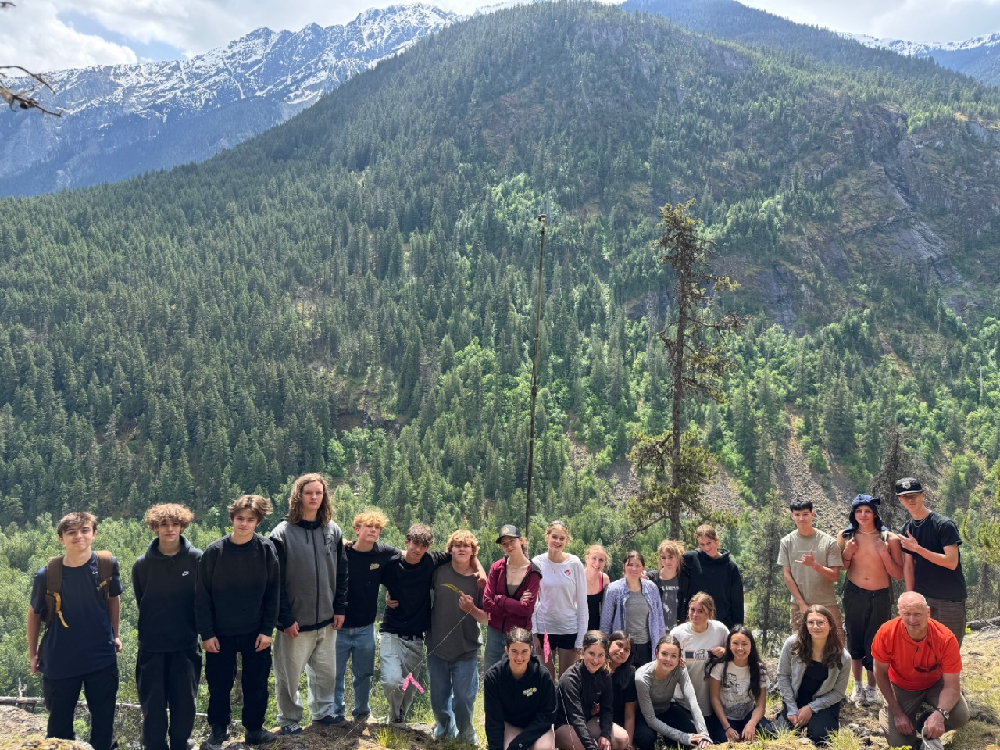



```{r}
#| label: create spp detections from Guano csv.
#| include: false
#| echo: false
#| eval: true
#| warning: false
#| message: false

#this code helps create a df that can be used for precese/abcese data summaries using the guano summary file.

#Saving it here for use, but this code chunk does not run anything and can be deleted if not in use.

# df <- read.csv("Data/GUANO_Complete_Metadata_20260130_112825.csv")
# 
# #create a spp. combined column with both autoID resutls
# 
# df <- df %>%
#   mutate(
#     WA_4letter = case_when(
#       # Keep non-species codes as-is
#       WA.Kaleidoscope.Auto.ID %in% c("NoID", "Noise", NA) ~ WA.Kaleidoscope.Auto.ID
#       ,WA.Kaleidoscope.Auto.ID == "" ~ "",
#       # Convert to 4-letter code
#       TRUE ~ paste0(substr(WA.Kaleidoscope.Auto.ID, 1, 2), 
#                     substr(WA.Kaleidoscope.Auto.ID, 4, 5))
#     )
#   )
# 
# # Define non-species codes
# non_species_codes_SB <- c("NOISE", "HiF", "LoF", "HiLo", "NoID")
# non_species_codes_WA <- c("NoID", "Noise")
# 
# df <- df %>%
#   mutate(
#     SB_clean = ifelse(
#       is.na(SB.Species.Auto.ID.verbose) | SB.Species.Auto.ID.verbose == "", 
#       "NOISE", SB.Species.Auto.ID.verbose),
#     WA_clean = ifelse(is.na(WA_4letter) | WA_4letter == "", 
#                       "NoID", WA_4letter),
#     # Check if each is a non-species code
#     SB_is_nonspecies = SB_clean %in% non_species_codes_SB,
#     WA_is_nonspecies = WA_clean %in% non_species_codes_WA,
#     
#     # Apply the logic
#     CombinedID = case_when(
#       # Both are non-species codes
#       SB_is_nonspecies & WA_is_nonspecies ~ "Low Quality Pass",
#       
#       # One is non-species, take the other
#       SB_is_nonspecies & !WA_is_nonspecies ~ WA_clean,
#       !SB_is_nonspecies & WA_is_nonspecies ~ SB_clean,
#       
#       # Both have species - check if they match
#       TRUE ~ {
#         # For each row, check if species match or combine them
#         mapply(function(sb, wa) {
#           # Check if they're the same species (case-insensitive)
#           if(toupper(sb) == toupper(wa)) {
#             # They match - return the uppercase version
#             return(toupper(wa))
#           } else {
#             # They don't match - combine them alphabetically (uppercase)
#             combined <- paste0(sort(c(toupper(sb), toupper(wa))), collapse = "")
#             return(combined)
#           }
#         }, SB_clean, WA_clean)
#       }
#     )
#   ) %>%
#   mutate(CombinedID = toupper(CombinedID)) %>% 
#   select(-SB_clean, -WA_clean, -SB_is_nonspecies, -WA_is_nonspecies)
# 
# ###-------Creating Site summary for PDF renders------------------------#
# #first identify the specific sites from the filenames
# data <- df %>%
#   mutate(site = str_extract(filename, "^[^_]+"))
# 
# #delete sites that are actually identified as transects
# data <- data[!grepl("202506", data$site),]
# 
# # Summarize which species were found at each site and by each detector
# detailed_summary <- data %>%
#   group_by(site) %>%
#   summarise(
#     n_files = n(),
#     combined_species = {
#       species <- CombinedID %>%
#         na.omit() %>%
#         str_split("[, ]+") %>% # Split by comma, space, or both
#         unlist() %>%
#         .[. != "" & !str_detect(., "(?i)^noise$")] %>%  # Remove empty and Noise only
#         unique() %>%
#         sort()
#       if(length(species) > 0) paste(species, collapse = ", ") else "None"
#     }
#   )
# 
# ###---------------Creating df for summary figures and heat maps-------------------#
# #first identify the specific sites from the filenames
# data <- df %>%
#   mutate(site = str_extract(filename, "^[^_]+"))
# 
# #delete sites that are actually identified as transects
# data <- data[!grepl("202506", data$site),]
# 
# # Corrected function
# create_species_matrix <- function(data, species_column, location_column = "site") {
#   # Create a dataframe with location and species strings
#   species_data <- data %>%
#     select(location = all_of(location_column), species_string = all_of(species_column)) %>%
#     filter(!is.na(species_string) & species_string != "" & species_string != "None") %>%
#     distinct()
#   
#   # Split comma-separated species into individual rows
#  species_long <- species_data %>%
#     separate_rows(species_string, sep = ",\\s*") %>%
#     # UPDATE SPECIES NAMES BEFORE FILTERING
#     mutate(species_string = case_when(
#       species_string == "HIGH FREQUENCY" ~ "HiF",
#       species_string == "LOW FREQUENCY" ~ "LoF",
#       species_string == "LOW FREQUENCY BAT" ~ "LoF",
#       species_string == "NoID" ~ "NOID",
#       species_string == "NO ID" ~ "NOID",
#       species_string == "NOISE?" ~ "NOISE",
#       TRUE ~ species_string  # Keep all other values as-is
#     )) %>%
#     filter(species_string != "" & 
#            species_string != "None" & 
#            species_string != "NOID" &
#            species_string != "NOISE"&
#            species_string != "Noise" &
#            species_string != "HiLo" ) %>%   
#     mutate(present = 1) %>%
#     distinct(location, species_string, .keep_all = TRUE)
#   # Create presence/absence matrix
#   species_matrix <- species_long %>%
#     pivot_wider(
#       names_from = species_string,
#       values_from = present,
#       values_fill = 0
#     ) %>%
#     arrange(location)
#   
#   return(species_matrix)
# }
# 
# 
# # ============================================================================
# # COMBINED KALEIDOSCOPE AND SONOBAT AUTO ID
# # ============================================================================
# 
# Spp_matrix <- create_species_matrix(data, "CombinedID")
# 
# # Convert to long format for ggplot
# Spp_long <- Spp_matrix %>%
#   pivot_longer(
#     cols = -location,
#     names_to = "species",
#     values_to = "present"
#   ) %>%
#   # Filter to only single species codes (4 letters or less)
#   filter(nchar(species) == 4) %>%
#   mutate(species = factor(species))
# 
# # Organize based on alphabetical order of locations
# Spp_long$location <- factor(Spp_long$location, 
#                             levels = sort(unique(Spp_long$location)))
# # Update the species codes to have full species names (if you have a species_names lookup)
# Spp_long$species <- species_names[as.character(Spp_long$species)]
# 
# 
# # Create heat map
# Spp_plot <- ggplot(Spp_long, aes(x = species, y = location, fill = factor(present))) +
#   geom_tile(color = "white", linewidth = 0.5) +
#   scale_fill_manual(
#     values = c("0" = "gray95", "1" = "#2C7BB6"),
#     labels = c("Absent", "Present"),
#     name = "Detection"
#   ) +
#   labs(
#     x = "Species Code",
#     y = "Location"
#   ) +
#   theme_minimal(base_size = 12) +
#   theme(
#     axis.text.x = element_text(angle = 45, hjust = 1, size = 10),
#     axis.text.y = element_text(size = 10),
#     plot.title = element_text(face = "bold", size = 14),
#     plot.subtitle = element_text(size = 11, color = "gray40"),
#     panel.grid = element_blank(),
#     legend.position = "bottom"
#   )
# saveRDS(Spp_plot, "Figures/Presense-Absence.rds")

```

```{r}
#| label: setup - load libraries and data
#| include: false
#| echo: false
#| eval: true
#| warning: false
#| message: false

#to render as PDF use this: quarto::quarto_render("2025NABat.qmd", output_format = "pdf")

library(ggplot2)
library(dplyr)
library(tinytex)
library(quarto)
library(lubridate)
library(flextable)
library(tidyverse)
library(kableExtra)
library(readr)
library(leaflet)
library(sf)

sites <- read_csv("Data/Pemberton_Survey123.csv")%>%
  rename_with(~ gsub(" ", ".", .x))

#make sure that the columns are the proper classes
sites$Date.Recording.Started <- as.Date(sites$Date.Recording.Started, "%m-%d-%Y")
sites$Date.Recording.Ended <- as.Date(sites$Date.Recording.Ended,"%m-%d-%Y")

sites <- sites %>%
    mutate(
    nights = as.numeric(difftime(Date.Recording.Ended, Date.Recording.Started, units = "days")) + 1)

#map all of the codes to species names
species_names <- c(
  "EPFU" = "Big Brown Bat",
  "MYCA" = "California Myotis",
  "MYTH" = "Fringed Myotis",
  "LACI" = "Hoary Bat",
  "MYLU" = "Little Brown Myotis",
  "MYEV" = "Long-eared Myotis",
  "MYVO" = "Long-legged Myotis",
  "MYSE" = "Northern Myotis",
  "LANO" = "Silver-haired Bat",
  "EUMA" = "Spotted Bat",
  "COTO" = "Townsend's Big-eared Bat",
  "MYCI" = "Western Small-footed Myotis",
  "MYYU" = "Yuma Myotis"
)


```

```{r}
#| label: setup - create sites table and sites_sf
#| include: false
#| echo: false
#| eval: true
#| warning: false
#| message: false
# Create cleaned dataframe with selected columns
sites_table <- sites[, c("Grid.Cell.Identifier",
                         "Grid.Cell.(GRTS).ID",
                          "x", 
                          "y", 
                          "Date.Recording.Started", 
                          "Date.Recording.Ended",
                          "Bat.Detector.Model",
                          "Detector.ID/Serial.Number")]
#keep a copy without the renamed columns to use for creating the map
sites_sf <- sites_table|>
  filter(!is.na(y) & !is.na(x)) |>
  sf::st_as_sf(coords = c("x", "y"), crs = 4326)

# Rename columns for better readability in the report
colnames(sites_table) <- c("Location Name",
                           "NABat GRTS ID",
                            "Longitude",
                            "Latitude",
                            "Start Date",
                            "End Date",
                            "Detector Model",
                            "Detector Serial Number")
sites_table$`NABat GRTS ID` <- as.character(sites_table$`NABat GRTS ID`)

```

## Land Acknowledgement

Biodiversity Pathways respectfully acknowledges that our work takes place on Treaty 8 and Douglas Treaties Territories as well as the traditional and unceded territories of First Nations and Métis Peoples across all regions of British Columbia, whose histories, languages, and cultures are deeply connected to the biodiversity we monitor. We acknowledge the traditional teachings of the lands that we work on, and that reciprocal, meaningful, and respectful relationships with Indigenous peoples make our work possible. We are deeply grateful for their stewardship of these lands, and we are committed to supporting Indigenous-led monitoring programs, while learning Indigenous ways of knowing, being, and doing.



## Introduction



### Overview of NABat and the NNW Bat Hub

The North American Bat Monitoring Program (NABat) is a large-scale coordinated effort to monitor bat species across North America using standardized protocols and a unified sample design [@loeb2015Plan]. NABat was established to address the gaps in knowledge and lack of long-term studies of bat species across Mexico, USA, and Canada. The program is administered by the US Geological Survey (USGS), and implemented by the North by Northwest Bat (NNW) Hub in British Columbia, Alberta, and S.E. Alaska.

### 2025 NABat Monitoring in Pemberton

In the field season of 2025, `r nrow(sites)` bat acoustic deployments were made at the Pemberton grid cell (GRTS ID: 143274). The monitoring stations collected data between `r min(sites$Date.Recording.Started)` and `r max(sites$Date.Recording.Ended)`. The recordings were submitted to the North by Northwest (NNW) Bat Hub for processing and inclusion in the provincial annual report on the state of bat populations within British Columbia.

## Methods

### Field Deployments

In 2025, grid leaders and volunteers deployed `r nrow(sites)` recording units in the Pemberton grid cell `r if(knitr::is_html_output()) {"([@fig-monitoring-locations])"} else {"([@tbl-sites])"}` following the standards set by NABat and the North by Northwest (NNW) Bat Hub [@reichert2018Guide]. All of these locations were established sites that have been monitored for 6 continuous years starting in 2019. In 2025 the recording units collected data for a total of `r sum(sites$nights, na.rm = TRUE)` ARU nights. ARU nights quantify the total acoustic sampling effort by summing the number of nights each ARU was deployed and recording. This metric accounts for all individual recorder deployments, such that two ARUs recording for seven nights would equal 14 ARU nights total, even if deployed concurrently.

```{r}
#| echo: false
#| eval: !expr knitr::is_latex_output()
#| warning: false
#| message: false
#| label: tbl-sites
#| tbl-cap: "Acoustic monitoring locations for bat surveys carried out in Pemberton in 2025"


if (knitr::is_latex_output()) {
    # PDF output
  sites_table %>%
    kable(format = "latex", booktabs = TRUE) %>%
    kable_styling(
      latex_options = c("scale_down", "striped","HOLD_position"),
      font_size = 7
    )
} 
```

```{r}
#| echo: false
#| eval: true
#| warning: false
#| message: false
#| include: true
#| fig-align: center
#| fig-cap: "Acoustic monitoring locations for bat surveys carried in Pemberton in 2025."
#| label: fig-monitoring-locations

# Check output format
if (knitr::is_html_output()) {
  # Interactive map for HTML ONLY
  # Create color palette by NABat GRTS ID (to group nearby sites)
  pal <- colorFactor(
    palette = "Set2", 
    domain = sites_sf$`Grid.Cell.(GRTS).ID`
  )
  
  # Create the map
  leaflet() %>%
    addTiles() %>%
    addCircleMarkers(
      data = sites_sf,
      popup = ~paste("<b>Site:</b>", Grid.Cell.Identifier, "<br>",
                     "<b>NABat GRTS ID:</b>", `Grid.Cell.(GRTS).ID`, "<br>",
                     "<b>Deployment Dates:</b>", Date.Recording.Started, "to", Date.Recording.Ended),
      fillColor = "#1d4566",  
      fillOpacity = 0.8,
      color = "black", 
      weight = 1,
      radius = 8 
    ) %>%
    addScaleBar(position = "bottomleft") %>%
    addMiniMap(position = "bottomright", toggleDisplay = TRUE)
  
} 
```

### Data processing

Full-spectrum recordings from the sampling periods were collected and processed using two automatic classifiers: Kaleidoscope's Bats of North America 5.4.0 classifier and Sonobat 3.0's northeastern British Columbia classifier. Manual verification is currently underway, and results can be shared upon request.

## Results and Discussion

Preliminary results show that the highest bat species diversity was detected in the SW and NE quadrants of the Pemberton grid, with 11 different species recorded at each location ([@fig-summary]). The Spotted Bat (*Euderma maculatum*) was detected only in the SW quadrant. Both the Hoary Bat (*Lasiurus cinereus*) and the Silver-haired Bat (*Lasionycteris noctivagans*) were detected across all sites. These two species have been recognized as endangered by COSEWIC [@committeeonthestatusofendangeredwildlifeincanada2023Hoary] and are expected to be listed under Canada's Species at Risk Act (SARA). The Little Brown Myotis (*Myotis lucifugus*), already listed under SARA, was also detected across all sites. The presence of these at-risk species indicates that this grid and region may be important for bat conservation and recovery efforts.

```{r}
#| label: fig-summary
#| fig-cap: Species detected in the Permberton grid cell using two autoID clasifiers (Kaleidoscope Pro and Sonobat 30). Combined species identifications were created by reconciling SonoBat and Kaleidoscope auto-ID results, retaining species codes when both classifiers agreed.
#| echo: false
#| warning: false
#| message: false

Spp_plot <- readRDS("Data/Presense-Absence.rds")

if (knitr::is_latex_output()) {
  # PDF output
  print(Spp_plot)
} else {
  # HTML output
  print(Spp_plot)
}
```

\clearpage

## Literature Cited
